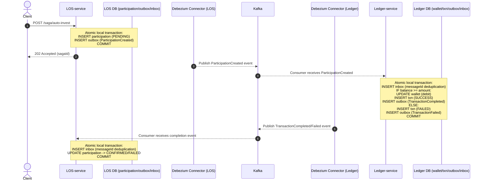
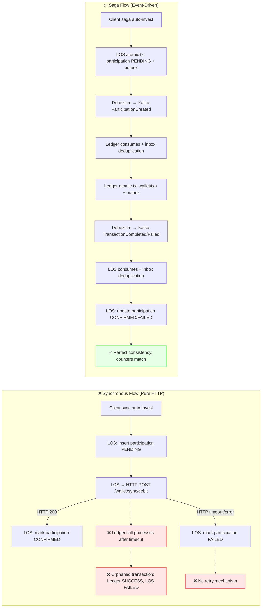
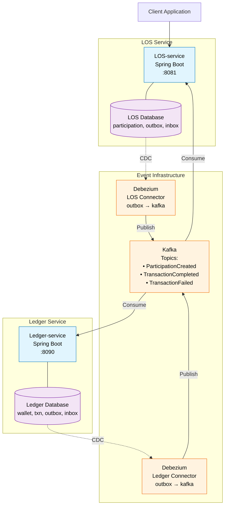

# Auto-Invest POC — Diagrams (Mermaid)

Use these Mermaid diagrams directly in your slides or README.

---

## 1) Event-Driven Saga (Sequence)

---

## 2) Sync vs Saga (Flow Comparison)

---

## 3) Architecture Overview

